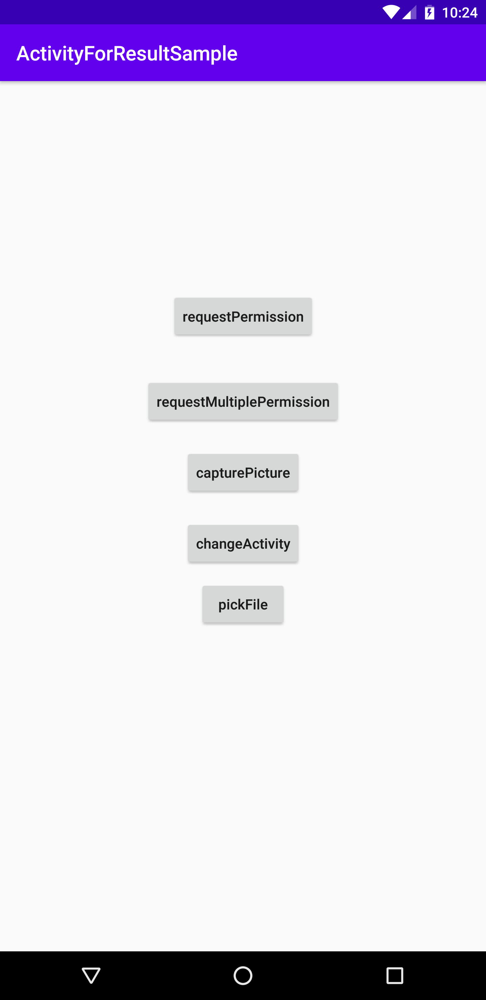

## Sample ActivityForResult usage 

The following items have been implemented by ActivityForResult Api in this runnable-app 

- Request runTime permission

- Request runTime MultiplePermission

- Taking a photo

- StartActivityForResult

- GetContent

##### Requirements : 

  - sdk 29+
  - buildTools 29.0.3
  - min sdk 17